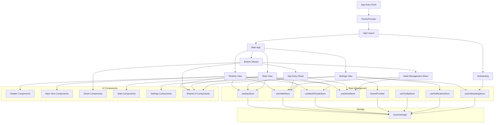
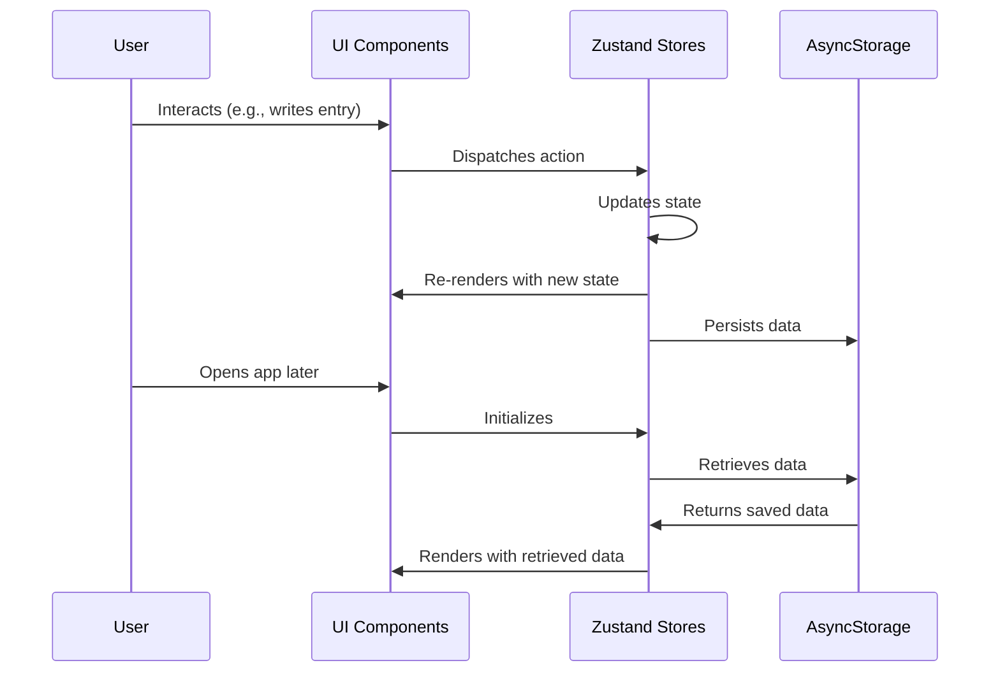
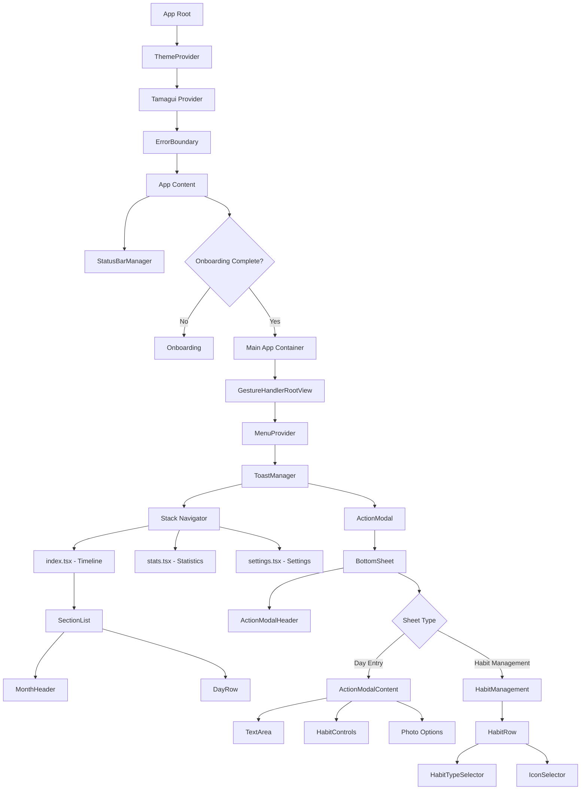
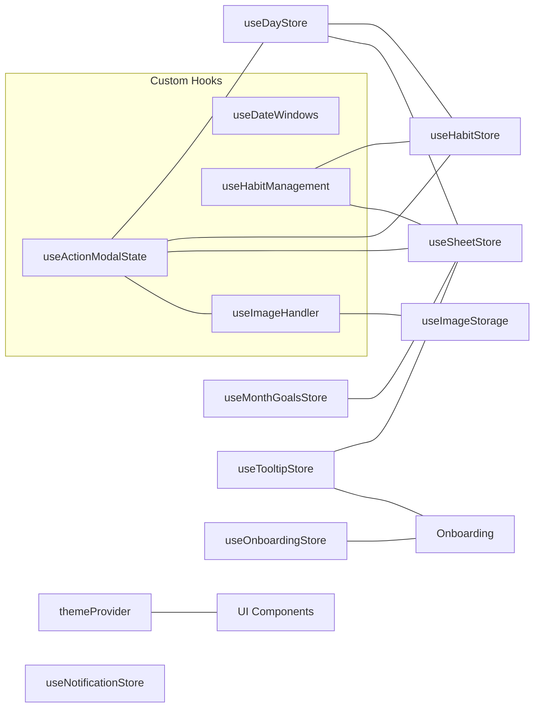
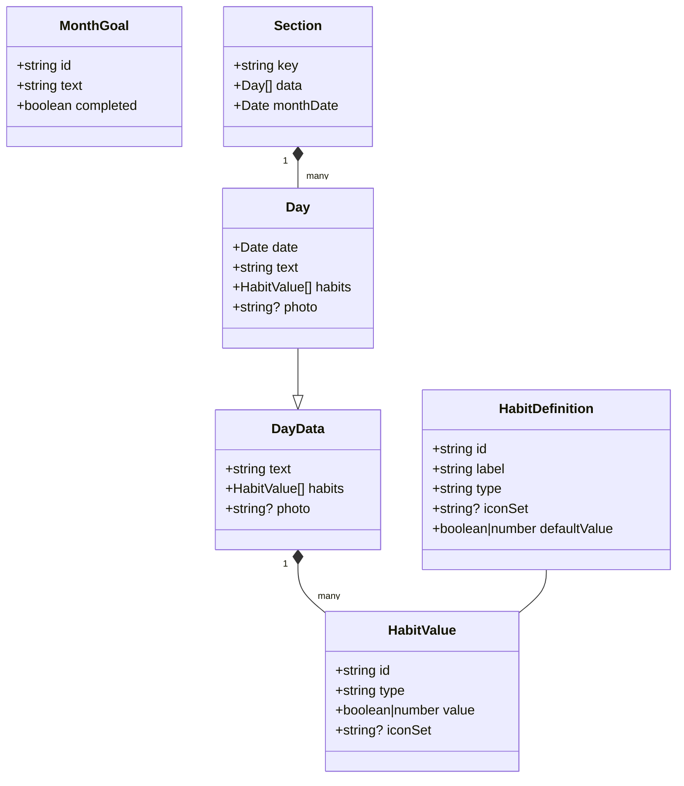

# App Architecture Diagram

## Application Architecture Overview

```mermaid
graph TD
    A[App Entry Point] --> B[ThemeProvider]
    B --> C[App Layout]
    C --> D[Onboarding]
    C --> E[Main App]
    
    E --> F[Timeline View]
    E --> G[Stats View]
    E --> H[Settings View]
    E --> I[Bottom Sheets]
    
    I --> J[Day Entry Sheet]
    I --> K[Habit Management Sheet]
    
    subgraph "State Management"
        S1[useDayStore]
        S2[useHabitStore]
        S3[useMonthGoalsStore]
        S4[useSheetStore]
        S5[themeProvider]
        S6[useTooltipStore]
        S7[useNotificationStore]
        S8[useOnboardingStore]
    end
    
    F --> S1
    F --> S2
    F --> S3
    F --> S4
    
    J --> S1
    J --> S2
    J --> S4
    
    K --> S2
    K --> S4
    
    G --> S1
    G --> S2
    G --> S3
    
    H --> S5
    H --> S7
    H --> S8
    
    D --> S8
    
    subgraph "Storage"
        ST1[AsyncStorage]
    end
    
    S1 --> ST1
    S2 --> ST1
    S3 --> ST1
    S5 --> ST1
    S6 --> ST1
    S7 --> ST1
    S8 --> ST1
    
    subgraph "UI Components"
        UI1[Header Components]
        UI2[Main View Components]
        UI3[Sheet Components]
        UI4[Stats Components]
        UI5[Settings Components]
        UI6[Shared UI Components]
    end
    
    F --> UI1
    F --> UI2
    
    I --> UI3
    
    G --> UI4
    
    H --> UI5
    
    F --> UI6
    I --> UI6
    G --> UI6
    H --> UI6
```

## Data Flow Diagram

```mermaid
sequenceDiagram
    participant User
    participant UI as UI Components
    participant Store as Zustand Stores
    participant Storage as AsyncStorage
    
    User->>UI: Interacts (e.g., writes entry)
    UI->>Store: Dispatches action
    Store->>Store: Updates state
    Store->>UI: Re-renders with new state
    Store->>Storage: Persists data
    
    User->>UI: Opens app later
    UI->>Store: Initializes
    Store->>Storage: Retrieves data
    Storage->>Store: Returns saved data
    Store->>UI: Renders with retrieved data
```

## Component Hierarchy

```mermaid
graph TD
    A[App Root] --> B[ThemeProvider]
    B --> C[Tamagui Provider]
    C --> D[ErrorBoundary]
    D --> E[App Content]
    
    E --> F[StatusBarManager]
    E --> G{Onboarding Complete?}
    
    G -->|No| H[Onboarding]
    G -->|Yes| I[Main App Container]
    
    I --> J[GestureHandlerRootView]
    J --> K[MenuProvider]
    K --> L[ToastManager]
    L --> M[Stack Navigator]
    L --> N[ActionModal]
    
    M --> O[index.tsx - Timeline]
    M --> P[stats.tsx - Statistics]
    M --> Q[settings.tsx - Settings]
    
    O --> R[SectionList]
    R --> S[MonthHeader]
    R --> T[DayRow]
    
    N --> U[BottomSheet]
    U --> V[ActionModalHeader]
    U --> W{Sheet Type}
    
    W -->|Day Entry| X[ActionModalContent]
    W -->|Habit Management| Y[HabitManagement]
    
    X --> Z[TextArea]
    X --> AA[HabitControls]
    X --> AB[Photo Options]
    
    Y --> AC[HabitRow]
    AC --> AD[HabitTypeSelector]
    AC --> AE[IconSelector]
```

## Store Relationships

```mermaid
graph LR
    A[useDayStore] --- B[useHabitStore]
    A --- C[useSheetStore]
    
    D[useMonthGoalsStore] --- C
    
    E[themeProvider] --- F[UI Components]
    
    G[useNotificationStore]
    
    H[useTooltipStore] --- C
    H --- I[Onboarding]
    
    J[useOnboardingStore] --- I
    
    subgraph "Custom Hooks"
        K[useActionModalState]
        L[useDateWindows]
        M[useHabitManagement]
        N[useImageHandler]
    end
    
    K --- A
    K --- B
    K --- C
    K --- N
    
    M --- B
    M --- C
    
    N --- O[useImageStorage]
```

## Data Structure

```mermaid
classDiagram
    class DayData {
        +string text
        +HabitValue[] habits
        +string? photo
    }
    
    class HabitValue {
        +string id
        +string type
        +boolean|number value
        +string? iconSet
    }
    
    class HabitDefinition {
        +string id
        +string label
        +string type
        +string? iconSet
        +boolean|number defaultValue
    }
    
    class MonthGoal {
        +string id
        +string text
        +boolean completed
    }
    
    class Section {
        +string key
        +Day[] data
        +Date monthDate
    }
    
    class Day {
        +Date date
        +string text
        +HabitValue[] habits
        +string? photo
    }
    
    DayData "1" *-- "many" HabitValue
    Day --|> DayData
    Section "1" *-- "many" Day
    HabitDefinition -- HabitValue
```
