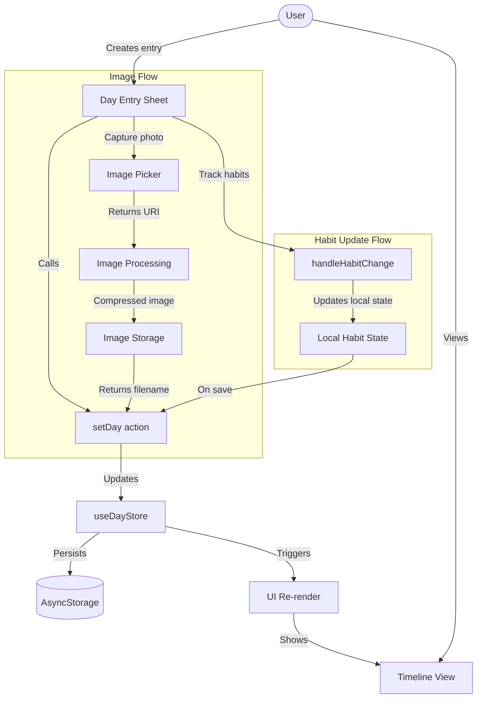
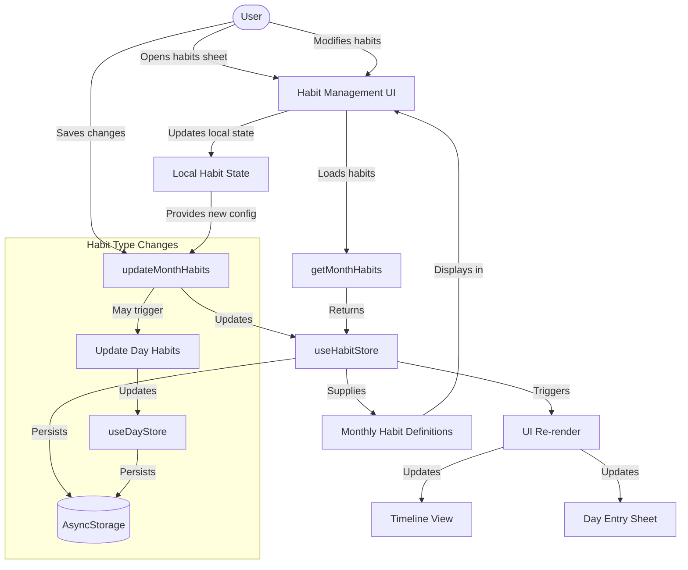
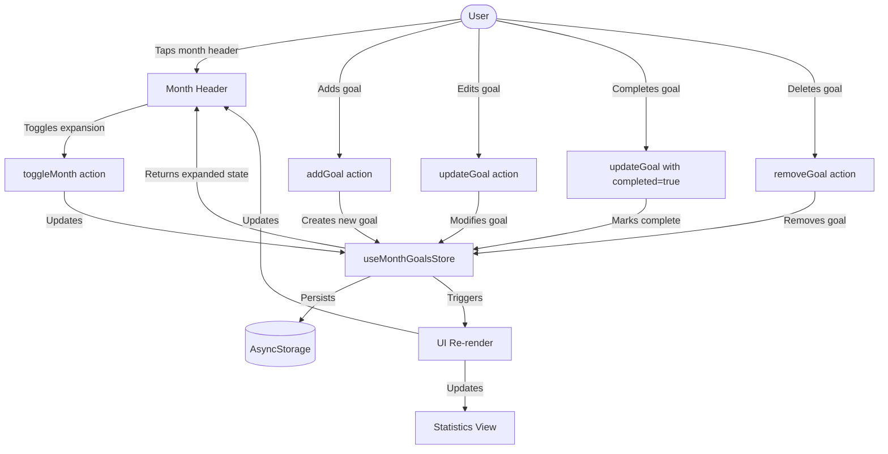
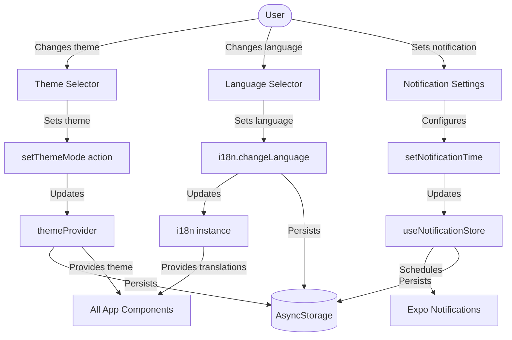
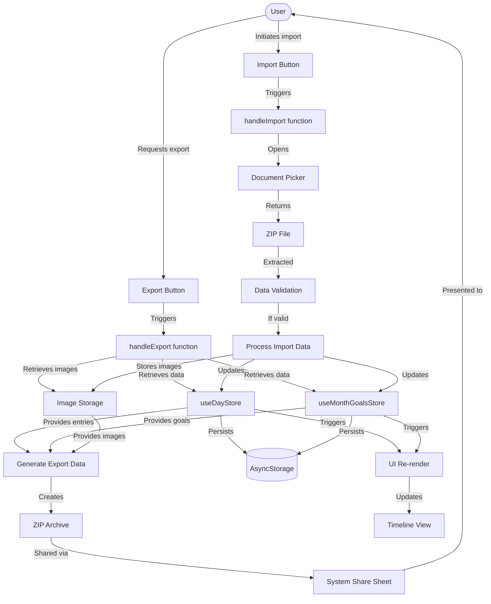
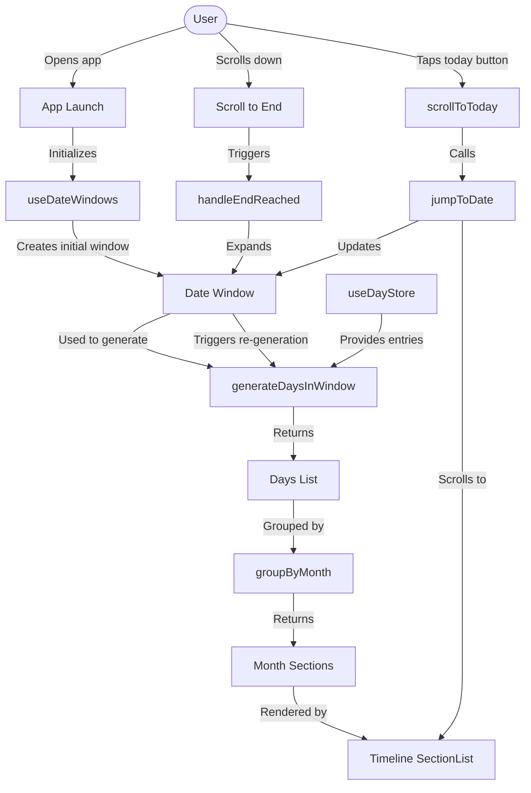
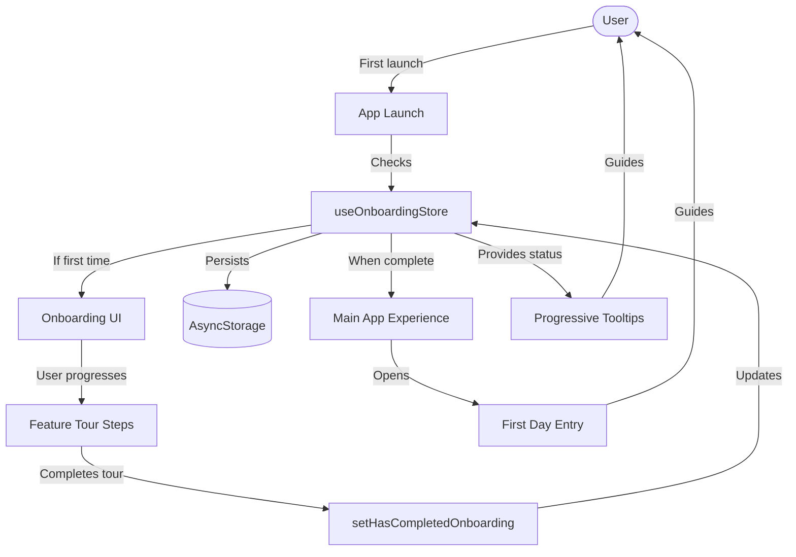
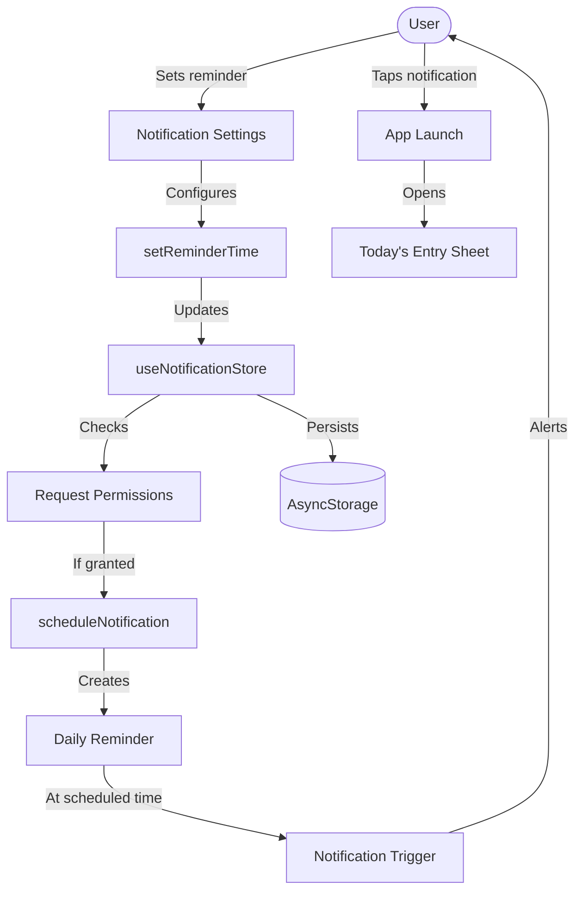
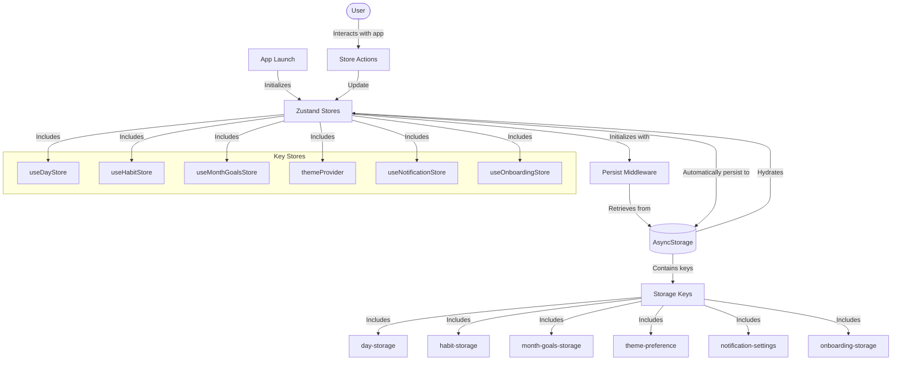

# Data Flow Diagrams

## Journal Entry Data Flow

## Habit Management Data Flow

## Monthly Goals Data Flow

## Settings and Theme Data Flow

## Data Export/Import Flow

## Timeline Data Loading Flow

## Onboarding Flow

## Notifications Flow

## State Persistence Flow

