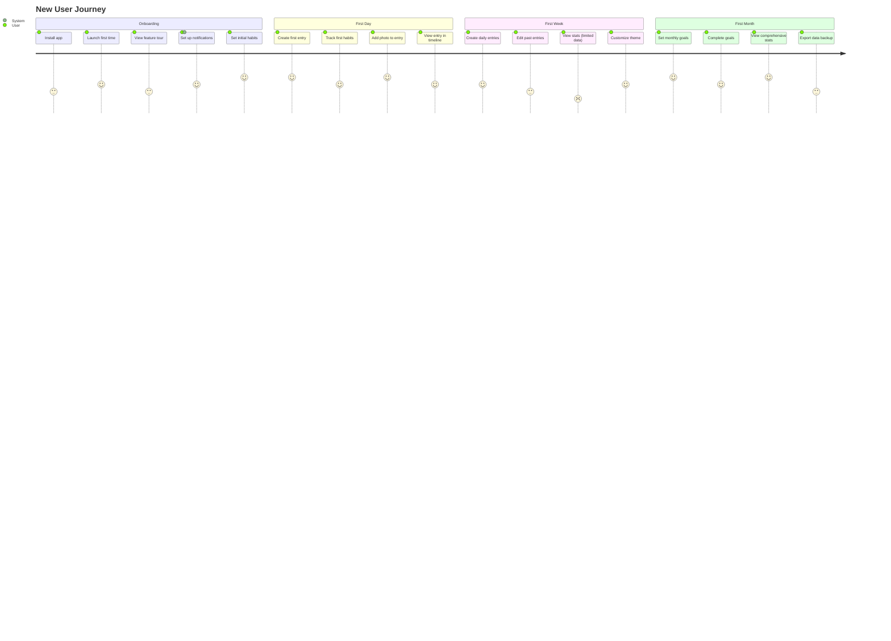
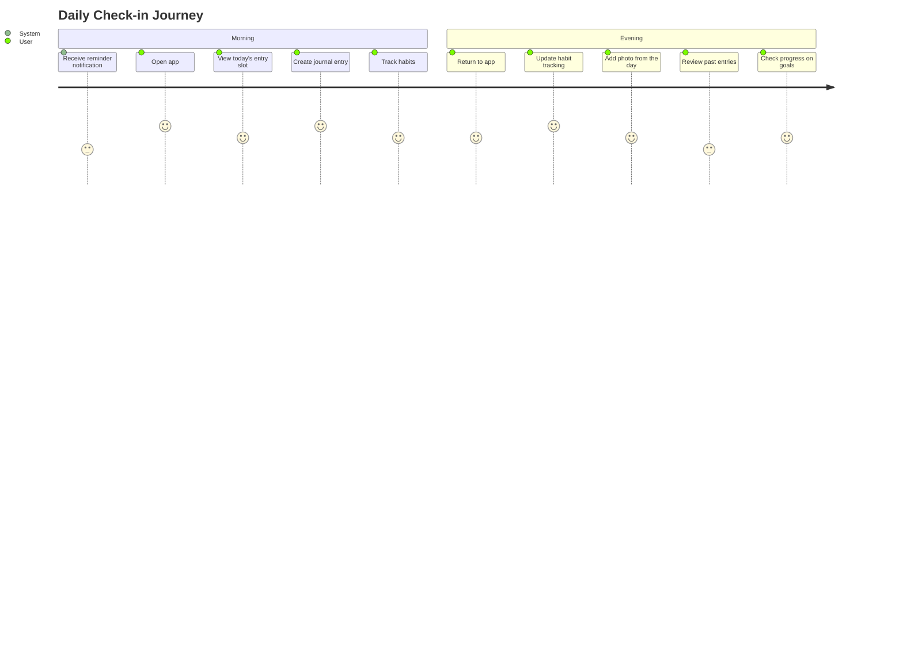
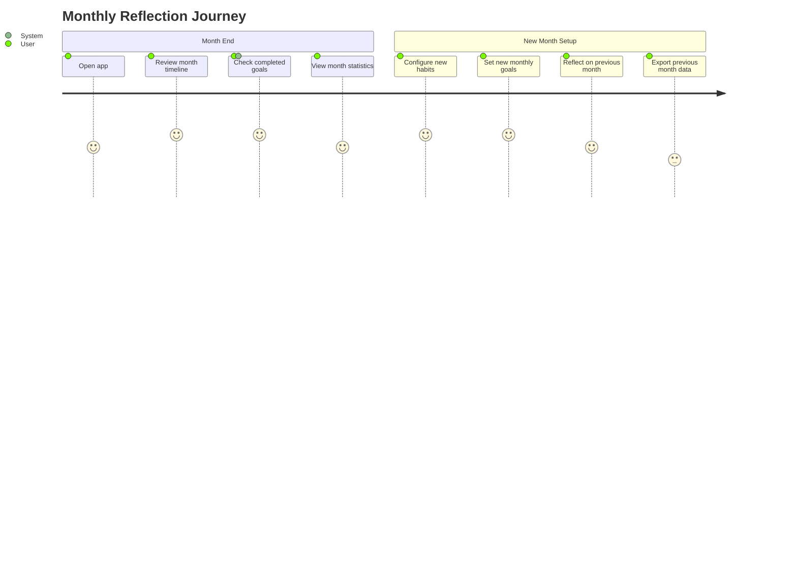
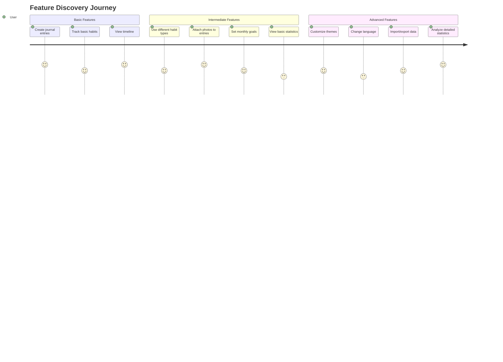
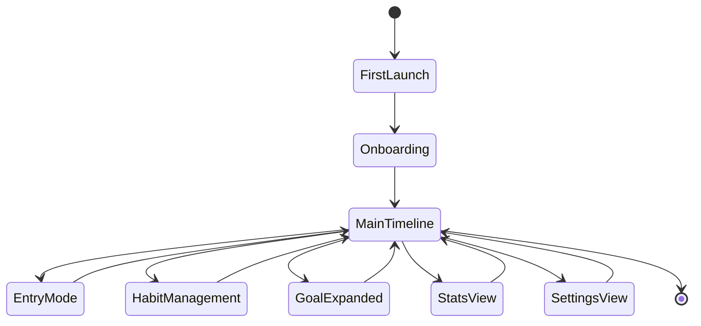
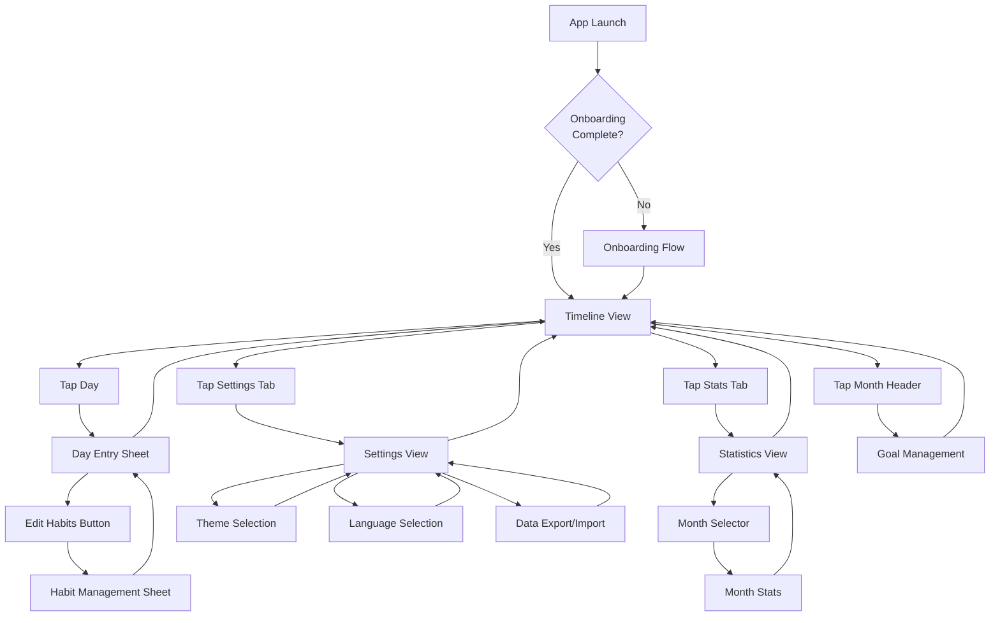

# User Journey Map

## First-Time User Journey

```mermaid
journey
    title New User Journey
    section Onboarding
        Install app: 3: User
        Launch first time: 4: User
        View feature tour: 3: User
        Set up notifications: 4: User, System
        Set initial habits: 5: User
    section First Day
        Create first entry: 5: User
        Track first habits: 4: User
        Add photo to entry: 5: User
        View entry in timeline: 4: User
    section First Week
        Create daily entries: 4: User
        Edit past entries: 3: User
        View stats (limited data): 2: User
        Customize theme: 4: User
    section First Month
        Set monthly goals: 5: User
        Complete goals: 4: User
        View comprehensive stats: 5: User
        Export data backup: 3: User
```

## Daily Check-in Journey

```mermaid
journey
    title Daily Check-in Journey
    section Morning
        Receive reminder notification: 3: System
        Open app: 5: User
        View today's entry slot: 4: User
        Create journal entry: 5: User
        Track habits: 4: User
    section Evening
        Return to app: 4: User
        Update habit tracking: 5: User
        Add photo from the day: 4: User
        Review past entries: 3: User
        Check progress on goals: 4: User
```

## Monthly Reflection Journey

```mermaid
journey
    title Monthly Reflection Journey
    section Month End
        Open app: 4: User
        Review month timeline: 5: User
        Check completed goals: 5: User, System
        View month statistics: 4: User
    section New Month Setup
        Configure new habits: 5: User
        Set new monthly goals: 5: User
        Reflect on previous month: 4: User
        Export previous month data: 3: User
```

## Feature Discovery Journey

```mermaid
journey
    title Feature Discovery Journey
    section Basic Features
        Create journal entries: 5: User
        Track basic habits: 4: User
        View timeline: 5: User
    section Intermediate Features
        Use different habit types: 4: User
        Attach photos to entries: 5: User
        Set monthly goals: 4: User
        View basic statistics: 3: User
    section Advanced Features
        Customize themes: 4: User
        Change language: 3: User
        Import/export data: 4: User
        Analyze detailed statistics: 5: User
```

## State Transitions During Use

```mermaid
stateDiagram-v2
    [*] --> FirstLaunch
    FirstLaunch --> Onboarding
    Onboarding --> MainTimeline
    
    MainTimeline --> EntryMode
    EntryMode --> MainTimeline
    
    MainTimeline --> HabitManagement
    HabitManagement --> MainTimeline
    
    MainTimeline --> GoalExpanded
    GoalExpanded --> MainTimeline
    
    MainTimeline --> StatsView
    StatsView --> MainTimeline
    
    MainTimeline --> SettingsView
    SettingsView --> MainTimeline
    
    MainTimeline --> [*]
```

## Navigation Flow

```mermaid
flowchart TD
    A[App Launch] --> B{Onboarding\nComplete?}
    B -->|No| C[Onboarding Flow]
    B -->|Yes| D[Timeline View]
    
    C --> D
    
    D --> E[Tap Day]
    E --> F[Day Entry Sheet]
    F --> D
    
    D --> G[Tap Stats Tab]
    G --> H[Statistics View]
    H --> D
    
    D --> I[Tap Settings Tab]
    I --> J[Settings View]
    J --> D
    
    D --> K[Tap Month Header]
    K --> L[Goal Management]
    L --> D
    
    F --> M[Edit Habits Button]
    M --> N[Habit Management Sheet]
    N --> F
    
    H --> O[Month Selector]
    O --> P[Month Stats]
    P --> H
    
    J --> Q[Theme Selection]
    J --> R[Language Selection]
    J --> S[Data Export/Import]
    Q --> J
    R --> J
    S --> J
```
